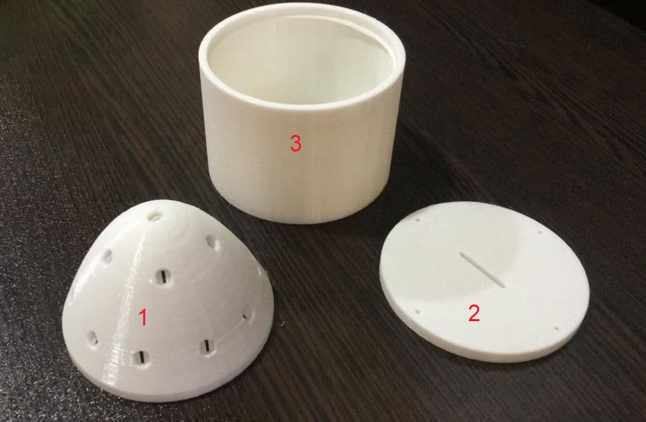

# Sunshine Recorder

## Overview
This repository contains the design and implementation of a Sunshine Recorder. In this project, we use C++ along with an Arduino Pro Mini, a real-time clock module, an SD card module, and photoresistors to record and analyze the amount and pattern of sunshine throughout the day. This project is a practical application related to my bachelor's thesis.

## Bachelor's Thesis
You can access my full bachelor's thesis, which provides in-depth details about the project's goals, methodology, and findings [here](Bachelor's-thesis-Mostafavi.pdf) (in Persian).

## Components
- **Arduino Pro Mini**: The core microcontroller used for data acquisition and control.
- **Real-Time Clock (RTC) Module**: Provides accurate timekeeping for timestamping sunshine data.
- **SD Card Module**: Used to store recorded data in a structured format.
- **Photoresistors**: Measure light intensity and are crucial for sunshine detection.

## Body components of the designed system

## Supervisor
I conducted this project under the guidance of Dr. Mehrdad Babazadeh, my supervisor at the University of Zanjan. Dr. Babazadeh's expertise and support were instrumental in the successful completion of this project.

## Usage
To replicate this project, follow these steps:

1. Set up your Arduino Pro Mini and wire the components as described in the [wiring_diagram.png](wiring_diagram.png) diagram.

2. Upload the provided C++ code [final.ino](final.ino) to your Arduino Pro Mini.

3. Power on the recorder and allow it to record sunshine data throughout the day.

4. Retrieve the recorded data from the SD card for analysis.

## Data Analysis
The recorded data can be further analyzed using data processing tools and techniques. You can refer to my bachelor's thesis for insights into data analysis methods and results.

## License
This project is licensed under the [MIT License](LICENSE).

## Contact
If you have any questions or need further information, feel free to contact me at [mrezamostafavi98@gmail.com](mailto:mrezamostafavi98@gmail.com).

Happy recording!
